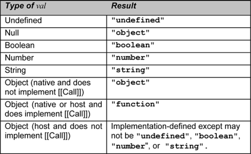

Title: typeof null === "object"

-----

Date: 1405539480

-----

Authors: rasshofer

-----

Text:

An initially confusing and counter-intuitive behavior of JavaScript is that the type determination of a variable being `null` using `typeof` returns `"object"`.

```javascript
var demo = null;
typeof demo; // "object"
```

The reason for this is that `typeof` will always return `"object"` for native non-callable objects. Actually, this stands since the beginning of JavaScript and the operator simply returns the type string of a given reference according to the table specified in the ECMAScript language specification [ECMA-262](http://www.ecma-international.org/publications/files/ECMA-ST-ARCH/ECMA-262%205th%20edition%20December%202009.pdf) (see page 81).



A fix that would have resulted in `typeof null === "null"` has been proposed (via an opt-in), but was rejected as it was too late to fix the "problem" as a change of `typeof null` would break existing code like incorrect implementations of type checks.
